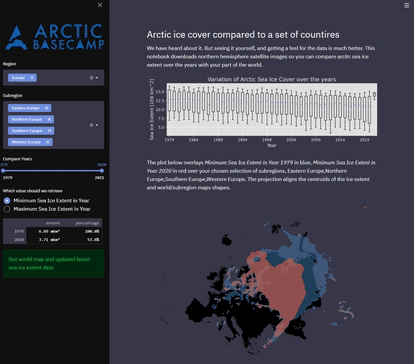

# Compare Arctic Sea Ice to regions of our planet

Use this app to compare the size changes of arcitc sea ice cover since 1978/1979 and a region of this planet. 
Check how much the ice covered area has changed over
time, by comparing it with country and region sizes for various years.

This app uses [NSIDC Sea Ice Index G02135](https://nsidc.org/data/g02135) data. 

_Fetterer, F., K. Knowles, W. N. Meier, M. Savoie, and A. K. Windnagel. 2017, updated daily._ Sea Ice Index, _Version 3. 
(arctic sea ice extent and arctic sea ice extent blue marble images). Boulder, Colorado USA. NSIDC: National Snow and Ice Data Center. 
[doi: https://doi.org/10.7265/N5K072F8]( https://doi.org/10.7265/N5K072F8)._

Made with Natural Earth. Free vector and raster map data @ naturalearthdata.com.

## Installation and running

This app uses [pipenv](https://pipenv.pypa.io/en/latest/), a [good guide is here, too](https://realpython.com/pipenv-guide/) to install dependencies.
We need
* streamlit
* geopandas _(Note: some platform do not automatically install descartes for map plotting, although pipenv should take care of this)._
* pandas, numpy, matplotlib

## TODO

* add country level selections
* twitter button

