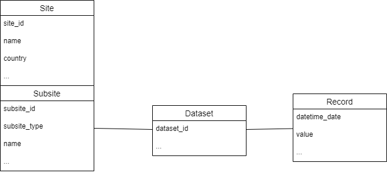

# Permafrost Data

This is a collection of notebooks and scripts that wrangle data on [permafrost](https://en.wikipedia.org/wiki/Permafrost) experiments. These are important indicators on climate change in arctic reagions (but also in alpine regions, our focus is on the former, at the moment)

The data model we use is simplified to facilitate data fusion:-

We use a semantic-free notation for downloaded data. The idea is to treat a data pipeline like an onion style set of original and derived data, and we borrow the semantics from the planetary system.

